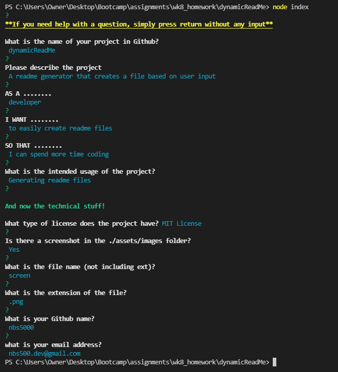

## ReadMe Generator - Steve Barry

##  The Task

The task was to create a solution that generates a readme file based on user input.

### ⭐ ⭐ S.T.A.R. ⭐ ⭐

**SITUATION**

The provided user story was: 

> AS A developer
> 
> I WANT a README generator
>
> SO THAT I can plan a trip accordingly

**TASK**

Provide a solution that allows a user to dynamically create readme file sor their projects.

**ACTION**

Writing of a solution to resolve the situation, including:

* Javascript
  * *Error free performance*
  * *Thorough comments*
* GIT
  * *Numerous commits to track changes in code*
  * *Code added to public repository and Github Pages for public viewing*
* Functionality
  * *Feedback to the user if answers no provided*
  * *Feedback to the user if answers given in incorrect format*
  * *Readme file generated based on user input*
  * *Readable title created from repository name*

**RESULT**

The end code is stored on Github, and publicly available and viewable. This result meets and exceeds all requirements of the User Story and acceptance criteria:

* ~~GIVEN a command-line application that accepts user input~~
* ~~WHEN I am prompted for information about my application repository~~
* ~~THEN a high-quality, professional README.md is generated with the title of my project and sections entitled Description, Table of Contents, Installation, Usage, License, Contributing, Tests, and Questions~~
* ~~WHEN I enter my project title~~
* ~~THEN this is displayed as the title of the README~~
* ~~WHEN I enter a description, installation instructions, usage information, contribution guidelines, and test instructions~~
* ~~THEN this information is added to the sections of the README entitled Description, Installation, Usage, Contributing, and Tests~~
* ~~WHEN I choose a license for my application from a list of options~~
* ~~THEN a badge for that license is added near the top of the README and a notice is added to the section of the README entitled License that explains which license the application is covered under~~
* ~~WHEN I enter my GitHub username~~
* ~~THEN this is added to the section of the README entitled Questions, with a link to my GitHub profile~~
* ~~WHEN I enter my email address~~
* ~~THEN this is added to the section of the README entitled Questions, with instructions on how to reach me with additional questions~~
* ~~WHEN I click on the links in the Table of Contents~~
* ~~THEN I am taken to the corresponding section of the README~~

##  The Outcome

As the acceptance criteria has been met and exceeded, the task is now complete. 

A video of the demonstration of the CLI application can be viewed here: 

> <a href="https://watch.screencastify.com/v/FBt117qRdsNqJ91mKaND">https://watch.screencastify.com/v/FBt117qRdsNqJ91mKaND</a>

Here is a screenshot of the CLI an dof the output:

> 
> 
---

Written by Steve Barry - Due date 07/02/2022

© 2022 Trilogy Education Services, LLC, a 2U, Inc. brand. Confidential and Proprietary. All Rights Reserved.

